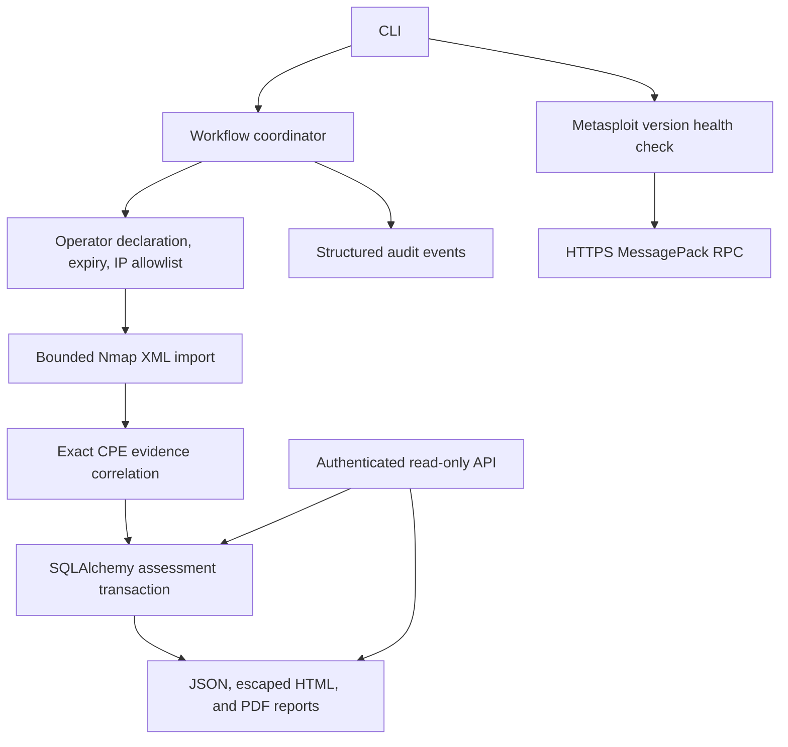

# RedOps architecture

Implementation reference, September 2026.

The supplied project brief is reference material. This implementation takes its
modular Python structure, inventory, vulnerability intelligence, audit, reporting,
and evaluation requirements. It implements a defensive assessment workflow.
Exploit selection, exploit configuration, payload generation, and execution are
outside this implementation. No target is contacted during an assessment.

## Boundaries

| Package | Responsibility |
| --- | --- |
| `redops/cli` | Argument parsing, commands, safe error messages |
| `redops/api` | Authenticated assessment access and report downloads |
| `redops/core` | Domain records, input limits, configuration, scope, audit, orchestration |
| `redops/recon` | Import Nmap XML; separately collect bounded TCP inventory in private labs |
| `redops/intelligence` | Local evidence, exact CPE correlation, NVD advisory providers and cache |
| `redops/database` | Typed persistence, portable backups, restore, explicit migration, retention |
| `redops/metasploit` | Authenticated version health check with verified TLS |
| `redops/reporting` | JSON, self-contained HTML, PDF, measured benchmark calculations |
| `labs` | Synthetic assessment fixtures and twelve healthy Docker inventory services |

The CLI depends on the workflow; parsers and matchers depend only on domain
records. The scan adapter invokes only a fixed Nmap TCP connect profile, without a shell.
The health adapter exposes only a version check and is separate from assessments.

`scan` is a separate inventory command: at most sixteen literal private/loopback
IPv4 addresses, thirty-two TCP ports, four concurrent probes, a 100 ms per-host
scan delay, one retry, a thirty-second host timeout, and a two-minute process
deadline shortened by scope expiry. It uses no scripts, service/version probes,
DNS, OS fingerprinting, CVE lookup, or RPC calls. Output is bounded and validated
against the requested hosts and ports, then published without overwriting files.
The adapter kills unfinished processes on errors. `ScanRunner` and
`MockScanRunner` support offline tests. Scans create XML and audit events;
assessment persistence remains a separate command. An empty result does not
establish that hosts are absent or secure.

## Evidence and uncertainty

An imported banner is an observation, not proof of an affected installation. A
catalog record declares exact, versioned CPEs, a vulnerability identifier, source,
CVSS score, and remediation. A match is always a candidate requiring review.
No numeric confidence is invented. Unsupported CPE encodings and absent versions
are reported as coverage gaps. Catalog data is explicitly supplied by the operator;
there is no implicit online lookup or product-name guessing.

Synthetic examples use `DEMO-*` identifiers and cannot be mistaken for real CVEs.
Real catalog records may use `CVE-YYYY-NNNN...` identifiers. NVD lookup requests
one exact CVE at a time and validates the response identifier and result count.
Verified TLS, timeouts, bounded retries, request pacing, CVSS precedence, and a
24-hour cache are implemented. Explicit workflow enrichment attaches advisory
context separately; it does not change the catalog's applicability evidence or
scores. NVD configuration trees are not flattened into affected-product claims.

## Persistence

`assessments` stores immutable report snapshots, input hashes, scope declarations,
and timestamps. `hosts`, `services`, and `vulnerabilities` preserve observations
within each assessment. `actions` records committed workflow completion in the
same transaction. Foreign keys and uniqueness constraints prevent orphaned or
duplicate observations. SQLite is the default; a PostgreSQL SQLAlchemy URL and
optional driver are supported. New databases use schema 2. Schema 1 remains
compatible; an explicit, backed-up migration adds the engagement/history index.
Unknown versions fail. Portable table archives use consistent snapshots and
bounded JSON. Restore requires empty tables, preserves observation identifiers,
and repairs PostgreSQL serial sequences. Retention previews engagement-specific
changes and requires an archive before deleting related rows transactionally.
See [database maintenance](database.md) for limits and operating procedures.

JSONL audit events record attempts, validation failures, previews, and completion.
They do not contain input document contents, credentials, or database URLs. The
file is append-only by application convention, not tamper-proof. Successful DB
actions are transactional; the separate audit file is not atomically committed
with the DB. A failure after DB commit must be reported as such.

## Scope and trust

The local CLI trusts the operating-system account. The read-only API requires a
shared bearer token for all data routes. The token has access to every engagement
in its database. An operator name and approval
declaration are attribution, not authentication or proof of legal authorization.
Scope documents require explicit IP/CIDR allowlists, approval attribution,
timezone-aware expiry, engagement ID, and a host limit. Every imported IP address
must be in scope before persistence. No DNS lookups take place.

Dry-run validates and correlates entirely in memory. It creates no database or
report files and makes no network requests. Its audit events are still appended.
XML entities and external references are forbidden, files are size-limited, and
HTML output escapes all imported text. Secrets for the optional RPC health check
come from the environment; TLS verification is mandatory and redirects are refused.

## Delivery sequence

1. Configuration, domain, scope policy, database, CLI.
2. Nmap XML import and atomic inventory persistence.
3. Reviewed local CVE evidence and explicit coverage reporting.
4. Separate Metasploit health adapter.
5. JSON/HTML/PDF reports, authenticated API, synthetic demonstration, benchmark calculator.
6. Regression tests, packaging, CI, Docker, installation documentation.

The API reads stored snapshots. PDF rendering uses local built-in fonts and
explicit Unicode escapes for unsupported characters. Schema upgrades run only
through the explicit maintenance command. A distributed job queue is unnecessary
for the bounded workflow.

## Reference contracts

- [SQLAlchemy typed ORM](https://docs.sqlalchemy.org/en/20/orm/quickstart.html)
- [SQLAlchemy transaction handling](https://docs.sqlalchemy.org/en/20/orm/session_basics.html)
- [Rapid7 RPC protocol](https://docs.rapid7.com/metasploit/rpc-api/)
- [NVD API documentation](https://nvd.nist.gov/developers/vulnerabilities)
- [Nmap TCP connect scanning](https://nmap.org/book/man-port-scanning-techniques.html)

These references document integration contracts; they do not establish that a
live external integration or production deployment has been validated.
